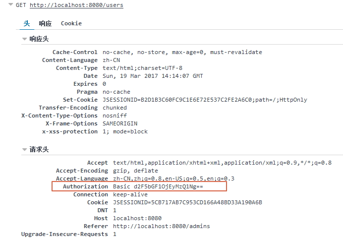

# 基本认证

基本认证在  Web 应用中是非常流行的认证机制。 基本身份验证通常用于无状态客户端，它们在每个请求中传递其凭证。 将其与基于表单的认证结合使用是很常见的，其中通过基于浏览器的用户界面和作为Web服务来使用应用。 但是，基本认证将密码作为纯文本传输，是不安全的，所以它只能在真正通过加密的传输层（如HTTPS）中使用。

## BasicAuthenticationFilter

BasicAuthenticationFilter 负责处理 HTTP 标头中提供的基本身份认证的凭证。 这可以用于认证由 Spring 远程协议（如 Hessian 和 Burlap ）以及正常的浏览器用户代理（如 Firefox 和 Internet Explorer）进行的调用。 管理 HTTP 基本认证的标准由 RFC 1945 第 11 节定义，并且 BasicAuthenticationFilter 符合该 RFC 标准。 基本认证是一种有吸引力的身份验证方法，因为它在用户代理中的部署非常广泛，实现非常简单，它只是`username:password`的 Base64 编码，在 HTTP 头中指定即可。

## 配置

AuthenticationManager 处理每个认证请求。 如果认证失败，将使用配置的 AuthenticationEntryPoint 重试认证过程。 通常，您将过滤器与 BasicAuthenticationEntryPoint 组合使用，它返回一个 401 响应与合适的头重试 HTTP 基本身份验证。 如果认证成功，生成的 Authentication 对象将照常放入 SecurityContextHolder。

如果认证事件成功，或者未尝试认证，因为 HTTP 头不包含支持的认证请求，则过滤器链将正常继续。 过滤器链将被中断的唯一时间点是认证失败并且调用 AuthenticationEntryPoint。

在配置类中，我们将 From 表单认证改为  Basic 认证:

```
......
.httpBasic()   // 使用 Basic 认证
	.and()
.sessionManagement().sessionCreationPolicy(SessionCreationPolicy.STATELESS)// 无状态
	.and()
......
```

## 运行

当我们试图访问受限的资源时，浏览器会弹出输入框，要求我们输入账号密码：


输入之后，就可以在访问相关页面了。我们可以在响应头里面，看到账号密码经过 Base64 编码之后的认证信息：

