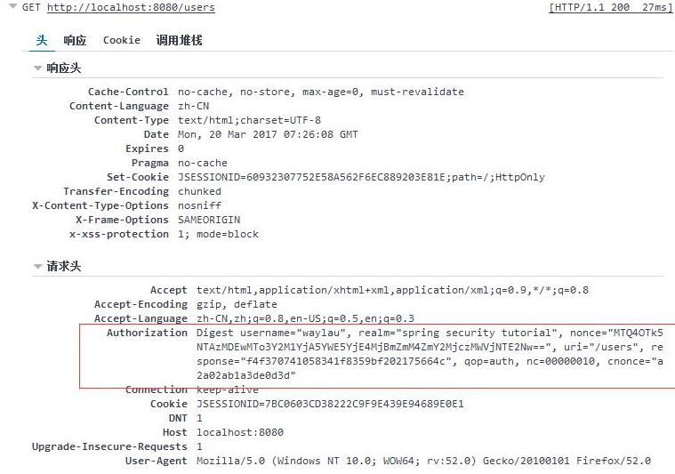
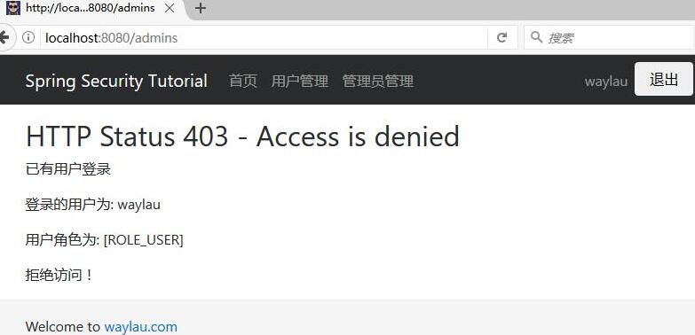

# 摘要认证

 在 `basic-authentication`项目的基础上，我们构建了一个`digest-authentication`项目。


## build.gradle
 
 修改 build.gradle 文件，让我们的`digest-authentication`项目成为一个新的项目。

修改内容也比较简单，修改项目名称及版本即可。

```groovy
jar {
	baseName = 'digest-authentication'
	version = '1.0.0'
}
```

## Spring Security 的摘要认证

DigestAuthenticationFilter 能够处理在 HTTP 头中显示的摘要身份验证凭据。摘要认证尝试解决基本认证的许多弱点，特别是通过确保凭证不会以明文方式通过网络发送。许多用户代理支持摘要身份验证，包括 Mozilla Firefox 和 Internet Explorer。管理 HTTP Digest 认证的标准由 RFC 2617 定义，RFC 2617 更新了较早版本的 RFC 2069 规定的摘要认证标准。大多数用户代理实现RFC 2617。Spring Security 的 DigestAuthenticationFilter 与RFC 2617规定中的“auth”保护质量（qop）兼容，同时与RFC 2069 向后兼。如果您需要使用未加密的 HTTP（即，没有 TLS/HTTPS）并希望最大化认证过程的安全性，摘要认证是非常有吸引力的选择。同时，摘要认证是WebDAV协议的强制性要求，如RFC 2518第17.1节所述：

>你不应该在现代应用程序中使用摘要，因为它不被认为是安全的。最明显的问题是您必须以明文、加密或MD5格式存储密码。所有这些存储格式都被认为不安全。相反，您应该使用单向自适应密码散列（即bCrypt、PBKDF2、SCrypt等）。

摘要认证的中心是一个“随机数”，这是服务器生成的值。 Spring Security 的随机数采用以下格式：

```
base64(expirationTime + ":" + md5Hex(expirationTime + ":" + key))
expirationTime:   随机数到期的日期和时间，以毫秒为单位
key:              用于防止随机数标记被修改的私钥
```

DigestAuthenticationEntryPoint 具有指定用于生成现时标记的密钥的属性，以及用于确定到期时间（默认300，等于五分钟）的nonceValiditySeconds属性。虽然该随机数有效，但是通过连接各种字符串来计算摘要，这些字符串包括用户名、密码、随机数、被请求的URI、客户端生成的随机数（只是用户代理生成每个请求的随机值）、领域名称等，然后执行 MD5 散列。服务器代理和用户代理都执行此摘要计算，如果它们对包含的值（例如密码）不同意，则导致不同的散列码。在Spring Security实现中，如果服务器生成的随机数已过期（但摘要有效），DigestAuthenticationEntryPoint 将发送一个“stale=true”头。这告诉用户代理没有必要打扰用户（因为密码和用户名等是正确的），而只是尝试再次使用一个新的随机数。

DigestAuthenticationEntryPoint 的 nonceValiditySeconds 参数的适当值取决于您的应用程序。在对安全非常重视的应用程序应该注意，截获的认证头可以用于模拟主体，直到到达随机数中包含的 expirationTime。这是选择适当设置的关键原则，但对于非常安全的应用程序，在第一次实例中不能通过TLS / HTTPS运行是不常见的。

由于 Digest 认证的更复杂的实现，常常有用户代理问题。例如，Internet Explorer 无法在同一会话中的后续请求上显示“opaque”标记。 Spring Security 过滤器因此将所有状态信息封装到“nonce”令牌中。在我们的测试中，Spring Security 的实现可靠地使用 Mozilla Firefox 和 Internet Explorer，正确处理随机数超时等。

## 配置

要实现 HTTP 摘要认证，需要在过滤器链中定义 DigestAuthenticationFilter。  同时需要配置 UserDetailsS​​ervice，因为 DigestAuthenticationFilter 必须能够直接访问用户的明文密码。如果在 DAO 中使用编码密码，Digest 身份验证将不会工作（如果DigestAuthenticationFilter.passwordAlreadyEncoded设置为true，则可以以HEX（MD5（username：realm：password））格式对密码进行编码。但是，其他密码编码将无法使用摘要身份验证。）。 DAO 协作者以及 UserCache 通常直接与 DaoAuthenticationProvider 共享。 authenticationEntryPoint 属性必须为 DigestAuthenticationEntryPoint，以便 DigestAuthenticationFilter 可以获取正确 的realmName 和摘要计算的键。

像 BasicAuthenticationFilter 一样，如果认证成功，那么认证请求令牌将被放入 SecurityContextHolder。如果认证事件成功，或者未尝试认证，因为HTTP头不包含摘要认证请求，则过滤器链将正常继续。过滤器链将被中断的唯一时机是如果认证失败并且调用了AuthenticationEntryPoint。

摘要认证的 RFC 提供了一系列附加功能，以进一步提高安全性。例如，可以在每个请求时更改随机数。尽管如此，Spring Security 实现旨在最小化实现的复杂性（以及将出现的无疑的用户代理不兼容性），并避免需要存储服务器端状态。如果您想更详细地了解这些功能，请受邀查看RFC 2617。据我们所知，Spring Security的实现确实符合该 RFC 的最低标准。


在配置类中，我们启用摘要认证过滤器 DigestAuthenticationFilter，并自定义 DigestAuthenticationEntryPoint:

```java
private static final String DIGEST_KEY = "waylau.com";
private static final String DIGEST_REALM_NAME = "spring security tutorial";
private static final int DIGEST_NONCE_VALIDITY_SECONDS = 240; // 过期时间 4 分钟

@Autowired
private UserDetailsService userDetailsService;

/**
 * 自定义 DigestAuthenticationEntryPoint
 * 
 * @return
 */
@Bean
public DigestAuthenticationEntryPoint getDigestAuthenticationEntryPoint() {
	DigestAuthenticationEntryPoint digestEntryPoint = new DigestAuthenticationEntryPoint();
	digestEntryPoint.setKey(DIGEST_KEY);
	digestEntryPoint.setRealmName(DIGEST_REALM_NAME);
	digestEntryPoint.setNonceValiditySeconds(DIGEST_NONCE_VALIDITY_SECONDS);
	return digestEntryPoint;
}

/**
 * 摘要认证过滤器
 * 
 * @param digestAuthenticationEntryPoint
 * @return
 * @throws Exception
 */
@Bean
public DigestAuthenticationFilter digestAuthenticationFilter(
		DigestAuthenticationEntryPoint digestAuthenticationEntryPoint) throws Exception {

	DigestAuthenticationFilter digestAuthenticationFilter = new DigestAuthenticationFilter();
	digestAuthenticationFilter.setAuthenticationEntryPoint(digestAuthenticationEntryPoint);
	digestAuthenticationFilter.setUserDetailsService(userDetailsService);
	return digestAuthenticationFilter;
}
```
最终配置如下：

```java
......
http
	.authorizeRequests()
		.antMatchers("/css/**", "/js/**", "/fonts/**", "/index").permitAll()  // 都可以访问
		.antMatchers("/h2-console/**").permitAll()  // 都可以访问
		.antMatchers("/users/**").hasRole("USER")   // 需要相应的角色才能访问
		.antMatchers("/admins/**").hasRole("ADMIN")   // 需要相应的角色才能访问
		.and()
	.addFilter(digestAuthenticationFilter(getDigestAuthenticationEntryPoint()))  // 使用摘要认证过滤器
	.sessionManagement().sessionCreationPolicy(SessionCreationPolicy.STATELESS)// 无状态
		.and()
	.exceptionHandling().accessDeniedPage("/403") // 处理异常，拒绝访问就重定向到 403 页面
	.authenticationEntryPoint(getDigestAuthenticationEntryPoint());   // 自定义 AuthenticationEntryPoint
......
```

## 运行

用户的状态信息都是保存在客户端（本例为浏览器），所以，即使后台服务器重启了，只要用户账号还在有效期内，就无需再次登录，即可再次访问服务。

当我们试图访问受限的资源时，浏览器会弹出输入框，要求我们输入账号密码：


输入之后，就可以在访问相关页面了。我们可以在响应头里面，看到摘要认证信息：



当访问其他没有权限的资源时，会有相应的提示：



## 如何注销账号

`HttpSecurity.logout()`  是清除  HttpSession 里面存储的用户信息。既然，我们是无状态（无会话），那么自然就无需调用 logout()。

如果是客户端是在浏览器，则直接关闭浏览器即可注销账号。
